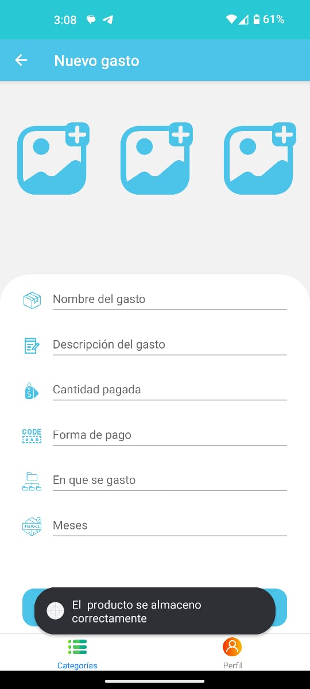

# Registro de Gastos - Prueba Técnica

Una aplicación móvil nativa para Android que permite a los usuarios llevar un registro de sus gastos diarios.

## Características

- **Pantalla principal:** Muestra una lista de todos los gastos registrados, con detalles como la fecha y el monto.
- **Agregar gasto:** Permite a los usuarios agregar nuevos gastos ingresando la fecha y el monto.
- **Editar gasto:** Permite a los usuarios editar la fecha y el monto de un gasto existente.
- **Eliminar gasto:** Permite a los usuarios eliminar un gasto existente de la lista.
- **Filtrar gastos:** Permite a los usuarios filtrar los gastos por fecha y monto.

## Requisitos Técnicos

- Desarrollada utilizando el marco de desarrollo para Android.
- Implementa las mejores prácticas de diseño y programación.
- Utiliza el patrón de arquitectura **MVVM (Modelo-Vista-ViewModel)** para una estructura modular y escalable.
- La persistencia de datos se realiza utilizando **SQLite**, una base de datos incorporada en Android, para el almacenamiento local de los gastos.
- Compatible con una amplia gama de dispositivos Android y versiones de Android.

## Tecnologías Utilizadas

### Frontend (Android)
- Expo 
- TypeScript 

### Backend
- Node.js 
- Express.js 
- Multer 
- Firebase 

### Almacenamiento en la Nube
- Firebase 
- AWS 

### Base de datos
- MySQL 

## Ejecución del Proyecto

1. Clona el repositorio en tu máquina local.
2. Abre el proyecto en Visual Studio.
3. Ingresa a la carpeta raíz del Frontend.
4. Ejecuta el comando `npm install` para que se instalen todas las dependencias.
5. Ejecuta el siguiente comando para instalar globalmente EAS: `npm install --global eas-cli`.
6. Te va a pedir una cuenta de Expo para poder compilar, te recomiendo tenerla para poder continuar.
7. Manda una compilación para lo que necesites con el siguiente comando: `eas build --profile development --platform android`.
8. En Expo, EAS existen tres perfiles para mandar la compilación, y dependiendo de qué mandes, va a mandar un resultado diferente. Son los siguientes:
   - development: Crea una APK que se instala de manera normal en el dispositivo Android físico y para que corra se deberá de levantar un servidor de Expo con el siguiente comando en terminal: `npx expo start`, lo que te permitirá loggear todo lo que pasa en la app.
   - preview: Crea un APK sin necesidad de levantar el servidor de Expo, pero no se podrá loggear.
   - production: Crea una compilación con terminación `.abb` para subir a Google Play Console y estar en producción.

## Instrucciones Adicionales

1. Se empezará a mostrar cómo sirve la app, se deberá de registrar por primera vez.

     

2. Se realizará el formulario de creación de perfil y llevará una imagen o foto de perfil. Por tiempo de la prueba no pude arreglar un error que aparecía para tomar foto relacionado al SDK 13.

     

3. A continuación, al llenar el formulario y crear el perfil, te va a verificar tu número por medio de un SMS. Automáticamente va a aparecer tu número de teléfono que asignaste a tu perfil. Se deberá de completar el CAPTCHA y te permitirá mandar el SMS. Deberás esperar de 20 segundos a un minuto para recibir el SMS. A continuación, agregarás el código y si es exitoso, se mostrará tu perfil verificado.

     
     
     
     
     

4. Al entrar a la app, te pedirá que autorices las notificaciones. Por cuestiones de tiempo, no pude implementar la idea que tenía con las notificaciones push.

    

5. A continuación, se mostrará el menú principal de gastos donde se muestra la categoría de gastos. Puedes separarlos de la manera que quieras o pienses en categorías como escolares, casa, salidas, etc. A continuación, en el símbolo de más en la parte superior derecha se le dará un clic para poder crear una nueva categoría.

    

6. Se creará con los tres campos que te pide una foto o archivo de la galería para identificarlos. El nombre y la descripción del gasto.

    
    

7. Al acabar, de manera automática al regresar se verá reflejado en tiempo real el nuevo ítem gracias al contexto de React para manejar eso. Además, se agregaron dos iconos al costado: uno azul que permite editar la categoría y uno rojo para eliminarlo.

    

8. Al seleccionar la categoría se entra a un submenú que te permite englobar los gastos que va a llevar esa categoría. Se repite el mismo proceso de registrar un gasto dándole clic en el signo de +. Se creará con un formulario, pero este será más complejo permitiéndonos llevar un mejor control de cómo se hizo o donde y poner comprobantes de pagos o el artículo en imágenes. De igual manera, te permite editar o eliminar el ítem. Una cualidad que tiene esta pantalla es que entre más ítems tenga se va a empezar o mostrar una barra de paginación para que se pueda hacer más fácil la gestión. Siempre aparece arriba el más reciente.

    
    
    
    
    

9. En el botón inferior derecho te permitirá ver el perfil del usuario con algunos datos básicos y editarlos. De igual manera, se puede hacer un logout con el botón en la parte superior derecha.

    
    

## Decisión de Diseño y Tecnologías

Se eligieron las tecnologías mencionadas por su compatibilidad y eficiencia en el desarrollo de aplicaciones móviles Android. El patrón de arquitectura MVVM se implementó para separar claramente las responsabilidades y facilitar la escalabilidad del proyecto. Además, se optó por MySQL para la persistencia de datos debido a su integración nativa en Android y su adecuado rendimiento para aplicaciones móviles en la nube. Esta app está montada en la nube permitiendo una gestión y manejo de datos más eficiente y fácil. Ocupé algunos de mis conocimientos, espero sea de su agrado esta prueba. Adjuntaré el APK en el correo y espero en el mismo repo.
